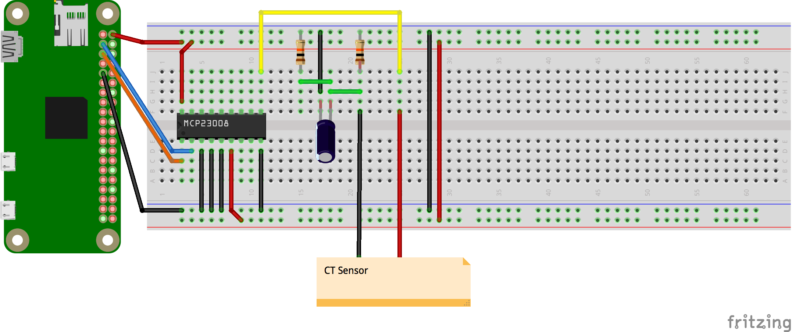

# coffeebot
The percolations are imminent.

# parts
- Raspberry Pi Zero
- [MCP23008](https://www.adafruit.com/products/593)
- [Non-invasive current sensor](https://www.sparkfun.com/products/11005)
- 2 10k resistors
- 1 10uF capacitor

# pi setup
- setup wifi
- enable ssh
- enable i2c
```
# /boot/config.txt
dtparam=i2c1=on
dtparam=i2c_arm=on
dtparam=i2c=on
dtparam=i2c_arm_baudrate=10000
```
- enable spi (not necessary)?
- `sudo apt-get update`
- `sudo apt-get upgrade`
- `ssh-keygen -t rsa -C pi@coffeebot`
  - copy contents of `id_rsa.pub` for github: `cat /home/pi/.ssh/id_rsa.pub`
- `sudo apt-get install git`
- node
```
cd /tmp
wget http://node-arm.herokuapp.com/node_latest_armhf.deb
sudo dpkg -i node_latest_armhf.deb

```

# wiring diagram

[coffeebot.fzz](assets/coffeebot.fzz)

# how it works
- discharge capacitor, time from full to full changes based on current

# configuration
* `threshold` description
* `consecutive` description
* `brew_time` description

# usage
coming soon